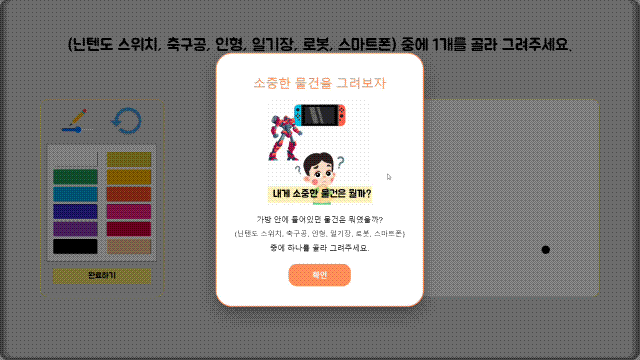
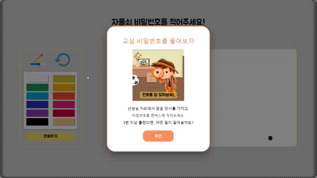
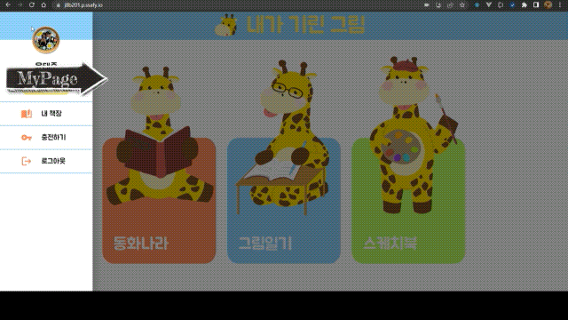
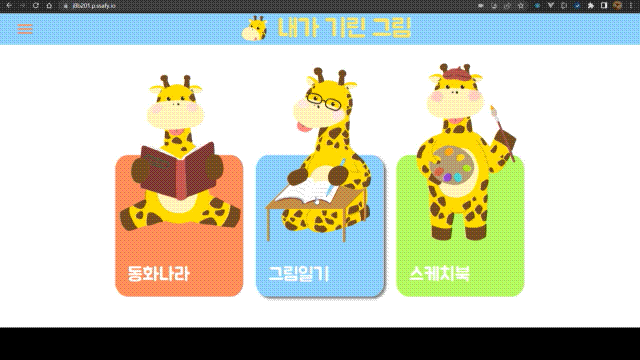
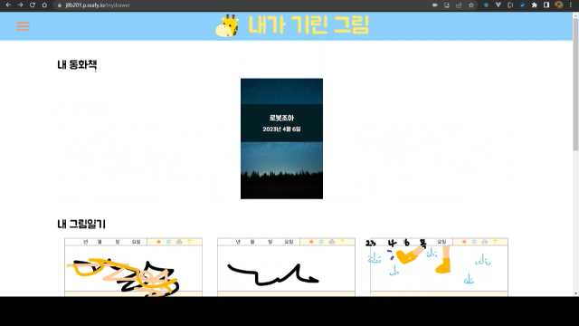
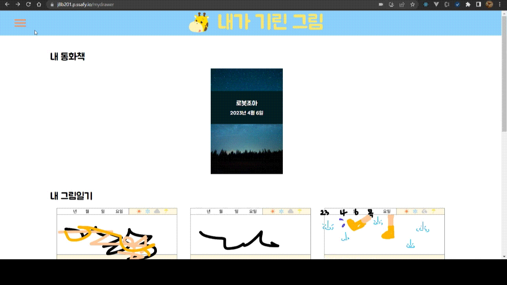

<br/>

# 🦒 내가 기린 그림 - AI 기반 인터랙티브 동화책

<video controls width="600">
  <source src="exec/[B201]-UCC.mp4" type="video/mp4">
</video>

> <br/>
>
> ***"내가 함께 만들어가는 추억과 이야기. 내가 바로 동화이자, 기린 그림이다!"*** <br/>
> 
> **내가 기린 그림**은 다양한 **영상 AI 기술**과 **게이미피케이션**을 적용해, 아이들이 인터랙티브 활동 요소가 가미된 동화책도 읽고, 그림 그리기 활동도 할 수 있는 웹 서비스 입니다. <br/>
> 
> <br/>

## 💡 기획 의도
> <br/>
> 
> **알파 세대의 정보 습득**
>
> MZ 세대의 다음 세대인 2010 년 이후 출생한 이들을 일컬어 알파세대라고 합니다.<br/>
> 이 알파세대의 특징은 태어날 때부터 스마트 기기와 함께 생활했고, 고도화된 기술 환경의 영향으로 네트워크 상에서의 커뮤니케이션이 익숙한 세대입니다.
> 이러한 알파세대들은 더 이상 텍스트가 아닌 영상 혹은 시각화된 자료를 통해 정보를 습득합니다.
>
> 저희는 이러한 흐름을 생각하며 기존의 EBOOK 형태의 동화에 게이미피케이션을 적용한 인터렉티브 웹 동화를 기획했습니다.
> 
> **우리의 목표**
> 동화책을 읽으면서 시각, 촉각적인 상호작용도 함으로써 아이들의 몰입감을 형성하고 더 나아가 학습의 효과도 기대할 수 있는 서비스가 저희의 지향점입니다.
> 
> <br/>
<br/> 

# ✨ 내가 기린 그림의 기능들

### 1. 나만의 동화책 만들기


<br/>

### 2. 영상 모델을 활용한 손동작 인식

<br/>

### 3. 이미지 모델을 활용한 사용자 그림 식별

<br/>

### 4. 이미지 모델을 활용한 사용자 숫자 그림 식별

<br/>

### 5. 내가 만든 작품들 모아보기


<br/>

### 6. Canvas를 활용한 손그림 트래킹?


<br/>

### 7. 카카오 소셜 로그인


<br/>

### 8. 카카오 페이 결제


<br/>

# 📜 프로젝트 상세

## [📋 API 명세](https://www.notion.so/API-07f34d5001a2472c85d6e2d21cc13bc8)

<details open>
  <summary> <b style="font-size:24px; color:skyblue;"> Backend Server API 명세 </b></summary>
  
</details>

<details open>
  <summary> <b style="font-size:24px; color:skyblue;"> ML Server API 명세 </b></summary>
  
</details>
<br/>

## 🔨기술 스택 정보

<details open>
  <summary> <b style="font-size:24px; color:skyblue;"> 🎨 FrontEnd </b></summary>
  <table>
    <tr>
      <th>기술</th>
      <th>버전</th>
      <th>설명</th>
    </tr>
    <tr>
      <td>React</td>
      <td>17.0.1</td>
      <td></td>
    </tr>
    <tr>
      <td>Redux</td>
      <td>4.2.1</td>
      <td></td>
    </tr>
    <tr>
      <td>MUI</td>
      <td>5.11.12</td>
      <td></td>
    </tr>
    <tr>
      <td>Styled-components</td>
      <td>5.3.6</td>
      <td></td>
    </tr>
    <tr>
      <td>React-P5</td>
      <td>1.3.33</td>
      <td></td>
    </tr>
    <tr>
      <td>Slick</td>
      <td>0.29.0</td>
      <td></td>
    </tr>
    <tr>
      <td>Eslint</td>
      <td>8.36.0</td>
      <td></td>
    </tr>
    <tr>
      <td>Prettier</td>
      <td>2.8.4</td>
      <td></td>
    </tr>
  </table>
  </details>

  <details open>
  <summary> <b style="font-size:24px; color:lightgreen;"> 💽 BackEnd </b></summary>
  <table>
    <tr>
      <th>기술</th>
      <th>버전</th>
      <th>설명</th>
    </tr>
    <tr>
      <td>Spring Boot</td>
      <td>3.0.x</td>
      <td></td>
    </tr>
    <tr>
      <td>Java</td>
      <td>OpenJDK 17</td>
      <td></td>
    </tr>
    <tr>
      <td>MariaDB</td>
      <td>10.11.2</td>
      <td></td>
    </tr>
    <tr>
      <td>MongoDB</td>
      <td>6.0.5</td>
      <td></td>
    </tr>
    <tr>
      <td>Redis</td>
      <td>7.0</td>
      <td></td>
    </tr>
    <tr>
      <td>Gradle</td>
      <td>7.6</td>
      <td></td>
    </tr>
    <tr>
      <td>JWT</td>
      <td></td>
      <td></td>
    </tr>
    <tr>
      <td>OAuth 2.0</td>
      <td></td>
      <td></td>
    </tr>
  </table>
  </details>

  <details open>
  <summary> <b style="font-size:24px; color:;"> 📡 DevOps </b></summary>
  <table>
    <tr>
      <th>기술</th>
      <th>버전</th>
      <th>설명</th>
    </tr>
    <tr>
      <td>Virtual Server (AWS EC2)</td>
      <td> Ubuntu 20.04 LTS</td>
      <td></td>
    </tr>
    <tr>
      <td>nginx</td>
      <td>1.18</td>
      <td></td>
    </tr>
    <tr>
      <td>Docker</td>
      <td>23.0.1</td>
      <td></td>
    </tr>
    <tr>
      <td>Ansible</td>
      <td>2.13.4</td>
      <td></td>
    </tr>
    <tr>
      <td>Jenkins</td>
      <td>2.387.1</td>
      <td></td>
    </tr>
  </table>
  </details>

  <details open>
  <summary> <b style="font-size:24px; color:yellow;"> 🤖 ML </b></summary>
  <table>
    <tr>
      <th>기술</th>
      <th>버전</th>
      <th>설명</th>
    </tr>
    <tr>
      <td>Flask</td>
      <td>2.2.3</td>
      <td></td>
    </tr>
    <tr>
      <td>flask_cors</td>
      <td>3.0.10</td>
      <td></td>
    </tr>
    <tr>
      <td>tensorflow</td>
      <td>2.12.0</td>
      <td></td>
    </tr>
    <tr>
      <td>keras</td>
      <td>2.12.0</td>
      <td></td>
    </tr>
    <tr>
      <td>numpy</td>
      <td>1.23.5</td>
      <td></td>
    </tr>
    <tr>
      <td>Pillow</td>
      <td>9.4.0</td>
      <td></td>
    </tr>
    <tr>
      <td>python-dotenv</td>
      <td>1.0.0</td>
      <td></td>
    </tr>
    <tr>
      <td>google-cloud-vision</td>
      <td>3.4.0</td>
      <td></td>
    </tr>
    <tr>
      <td>google-cloud-texttospeech</td>
      <td>2.14.1</td>
      <td></td>
    </tr>
  </table>
  </details>
<br/>

## 그라운드 룰
<details open>
  <summary> <b style="font-size:18px;"> 보기 </b></summary>

> <br/>
>
> - 매일 스크럼을 통해 진행 상황을 공유합니다. 
> <br/>
> 
> - 교육장에 지각 시 팀원들에게 커피 쏘기! 
> <br/>
> 
> - 50분 업무, 10분 휴식(눈치보지 말고 쉬기!!)  
> <br/>
> 
> - 스크럼 시간에는 To do / Work In Process / Done 을 각자 팀원에게 공유합니다. 
> <br/>
> 
> - 스크럼 시간에 자신의 에너지 레벨에 대해 알립니다. 에너지 레벨이 낮은 사람은 가능한 부담이 덜한 이슈를 맡습니다. 
> <br/>
> 
> - Notion, JIRA, Gitlab은 틈틈이 확인합니다!!!!!!!!! 
> <br/>
> 
> - 팀 단체 톡방 메시지는 되도록 30분 이내에 답변해줍니다. `→ 할까 말까` 
> <br/>
> 
> - 거짓말을 하지 않습니다. 
> <br/>
> 
> - 의견 낼 때 주저 하지 않기 `(조심스럽게 / 아니에요 / 잊어주세요 금지)` 
> <br/>
> 
> - 😊😊😊 **칭찬은 아낌없이 하기** 😊😊😊 
> <br/>
> 
> - 아플 것 같으면 미리 이야기하기. `(챙겨드림)` 
> <br/>
> 
> - 같이 공부 할 사람은 미리 이야기해서 같이하기? 
> <br/>
>
> - 새로 배운 거, 1시간 이상 고민한 것들은 정리해서 공유하기 <br/>
> 
> <br/>

</details>
<br/>


## 🔖 개발 컨벤션

<details open>
  <summary> <b style="font-size:24px;"> <a href="https://www.notion.so/Git-Convention-9a5988f2f73e4032ac787ade0fa03fc1">Git Convention</a> </b></summary>

### 1.  Branch
> <br/>
> 
> 브랜치 전략은 Git flow 전략을 사용합니다.
master → develop → feature → release → master의 순서로 브랜치 분할 & 병합이 발생하며 `절대로 혼자서 master 브랜치에 병합하는 일이 없도록` 합니다.
> 
> <br/>

- **Git flow 참고**
    
    [Git Flow 전략에 대해...](https://velog.io/@ljdongz/Git-Flow-%EC%A0%84%EB%9E%B5%EC%97%90-%EB%8C%80%ED%95%B4)
    
    [(알아두면 개발팀장가능) GitFlow vs Trunk-based 협업방식](https://www.youtube.com/watch?v=EV3FZ3cWBp8)
<br/>
    

### 2. Commit Message
> <br/>
> 
> 커밋 메시지는 함수 별, 단위 작업 별로 추가합니다. `(한꺼번에 staging 금지)`
커밋 메시지는 [Udacity Git Commit Message Style Guide](https://udacity.github.io/git-styleguide/) 에 따라 작성하되, 한글로 작성합니다.
> 
> 
> 커밋 메시지 Footer 에는 작성자, 이슈 키를 포함합니다.
> 
> ~~커밋 메시지 Body 앞에는 Gitmoji를 붙입니다.~~
> 
> <br/>

```bash
feat: 로그인 버튼 제작

로그인 화면에 로그인 버튼을 추가하였습니다.

Issue: [SB123-34525]
```

```bash
feat: 기능 구현
# ex) 로그인 기능 로직(.java, .js, .html, .css)를 작성하는 일체의 작업

fix: 버그 수정
# ex) 로직에 문제가 있거나 pull/merge 시 문제가 발생한다면

docs: 문서 작업
# ex) Gitlab 리포지토리 내의 문서 작업 시, 또는 주석만을 추가한 경우

style: 오탈자 / 맞춤법 수정
# ex) 로직은 변함이 없으나, 컨벤션에 맞게 수정작업을 했다면

design: 사용자 UI 디자인 변경
# ex) .html, .css 파일 등 화면 UI 파일 수정 작업을 했다면

refactor: 리팩터링
# ex) style과 달리, 모듈화, 함수 분리 등의 수정이 있었다면

test: 테스트 작성
# ex) 단위 테스트 코드를 작성한 뒤 커밋 올릴 때

chore: 빌드 수정, 프로젝트 설정 파일 수정
# ex) 설정 파일이나 의존성 파일을 수정한 경우 (로직은 수정 X)

release: 배포, CI/CD 등 release branch에서 작업하는 내용
# ex) 배포를 위한 merge나 배포 준비와 관련해서 수정이 일어난 경우

hotfix: hotfix 브랜치에서 작업하는 모든 커밋 내용들
```

- **Style Guide & Gitmoji 참고**
    
    Style Guide
    
    [Git | git 커밋 컨벤션 설정하기](https://velog.io/@shin6403/Git-git-%EC%BB%A4%EB%B0%8B-%EC%BB%A8%EB%B2%A4%EC%85%98-%EC%84%A4%EC%A0%95%ED%95%98%EA%B8%B0)
    
    [[Git] commit(커밋) 메세지 스타일 가이드](https://sungwookoo.tistory.com/1)
    
    Git Commit Messege Header Convention
    
    [좋은 git commit 메시지를 위한 영어 사전](https://blog.ull.im/engineering/2019/03/10/logs-on-git.html)
    
    IntelliJ Gitmoji Plugin
    
    [Gitmoji 사용하기](https://treasurebear.tistory.com/70)
    
    VSCode Gitmoji Plugin
    
    [[GIT] ⚡️ Gitmoji 사용법 정리 (+ 깃모지 툴 소개)](https://inpa.tistory.com/entry/GIT-%E2%9A%A1%EF%B8%8F-Gitmoji-%EC%82%AC%EC%9A%A9%EB%B2%95-Gitmoji-cli)
<br/>

### 3. Pull Request
> <br/>
> 
> 기능을 합칠 때는 반드시 merge request를 게시해 리뷰를 기다립니다.
각 파트 lead들은 완료된 PR에 한해 리뷰를 달고 머지할 지 말지를 결정하며, `MR을 작성하고 병합할 때 무조건 변경사항을 확인`합니다.
> 
> <br/>

- **PR 컨벤션 참고**
    
    [Git Pull Request 컨벤션](https://beststar-1.tistory.com/12)
    
    컨벤션 예시
    
    [https://github.com/HwangWonGyu/news/issues](https://github.com/HwangWonGyu/news/issues)
<br/>

### 4. User and Access Level
> <br/>
> 
> 유저 이름은 **한글 실명**으로 하고, 팀 구성원 모두 maintainer 권한을 가집니다.
각자의 MR은 전부 자신이 처리합니다.
> 
> <br/>

- 유저 설정

```bash
git config --global user.name "홍길동"
```

- 권한 별 차이
    - Maintainer는 MR을 생성, 승인하고 브랜치를 병합할 수 있는 권한을 가집니다.
    - Developer는 MR을 생성할 수 있지만 브랜치는 병합할 수 없습니다.

</details>

<details open>
  <summary> <b style="font-size:24px;"> <a href="https://www.notion.so/Jira-Convention-2778babae91143bfb33626453ec15270">JIRA Convention</a> </b></summary>

## 1. Epic
> <br/>
> 
> 기능 **대분류** 단위로 에픽을 나눕니다.
> 
> <br/>

```markdown
# 예시
- 회원 관리
- 스터디 기능 제작
- 화상 회의 기능 제작
```

- Epic 이란
    - 작업 계층 구조의 최상위 계층
    - 완료 하기 까지 긴 시간이 필요하거나 몇 번의 스프린트가 요구되는 큰 업무 덩어리
    - 여러 개의 스토리로 또는 태스크로 나눌 수 있음
    - 프론트와 백엔드 같이 진행

## 2. Story
> <br/>
> 
> 회의나 공부와 같이 **개발 외**의 작업에 대해 작성합니다.
> 
> <br/>

```markdown
# 예시
// Epic 라이브 방송
- Front-End 개발 시작해보기 : React & 공통 2주차
- Front-End 개발 시작해보기 : Flutter
```

- Story 란
    - 유저 스토리로 불리며, 엔드 유저의 관점에서 쓰여진 간단한 요구 사항
        - 이번 프로젝트에서는 개발 외 작업에 대해 작성하는 것으로 정의
    - 스토리는 하나의 심플한 이야기라고 할 수 있음
    - 연관된 스토리들이 모여서 하나의 에픽을 생성
    - 프론트와 백엔드 같이 진행

## 3. Task
> <br/>
> 
> 포지션 별 **개발** 작업에 대해 작성합니다.
> 
> <br/>


```markdown
# 예시
- [FE] 회원가입 - 회원가입 페이지 구현
- [BE] 회원가입 - 회원 엔티티와 리포지토리 구현
- [FE] 로그인 - 로그인 페이지 구현
- [BE] 로그인 - 로그인 요청 인증 로직 구현
```

- Task란
  - Epic를 완료하기 위해 개발자가 작업해야 하는 단위 작업

## 4. Scrum
> <br/>
> 
> 스크럼 시작 전 자신의 `To-do` 이슈들을 추가합니다.<br/>
> 
> [개인 공부] 이슈는 오늘 공부할 토픽으로 이름을 바꿉니다.<br/>
> 
> `Work In Process` 이슈들 중 오늘 완료하지 못한 이슈들은 완료될 때 <br/>`Done`으로 넘깁니다.
> 
> 만약 스프린트가 끝날 때 까지 완료하지 못한 Issue들은 `Done`으로 넘기지 않은 채로 스프린트를 종료하여 Backlog로 다시 보냅니다.
> 
> <br/>

</details>

<details open>
  <summary> <b style="font-size:24px;"> <a href="https://www.notion.so/Frontend-Convention-df5f92bca6da43bcb75bcdadc3ca9b30">Frontend Convention</a> </b></summary>

- 함수를 만들 때는 function() 형태가 아닌 const name = () ⇒ {} 형태인 화살표 함수로 사용해줍니다.
- 함수가 끝날 때 마다 세미 콜론을 사용해줍니다.
- 함수마다 어떤 목적으로 쓰였는지 주석을 달아주셔야 합니다.
    - 함수의 내용 경우 함수 위에
    - 함수 내의 내용의 경우 화살표 밑에
- 함수 명은 camelCase를 사용합니다.
- 기본적으로 prettier를 설치하여 우선 prettier의 기본을 원칙으로 한다. (PrintWidth : 80으로 TabWidth : 2 로 설정해 놓습니다.)
- vs code 폰트는 D2 Coding 폰트 사용.
- 모달 창 관련 css 파일은 관련 이름.module.css 파일로 생성하기.

</details>

<details open>
  <summary> <b style="font-size:24px;"> <a href="https://www.notion.so/Backend-Convention-e0261a87de374de58713fb85f25c381b">Backend Convention</a> </b></summary>

## 1. common

> <br/>
>
> 기본적으로 Google Java Convention을 따릅니다.
>
> <br/>

```java
public class Main {

	public static void main(String[] args){
		...
	}

}
```

- 자바 코드 컨벤션을 지키면서 프로그래밍한다.
- Intellij 기본 자동정렬(ctrl+alt+L)을 사용한다.
- indent(인덴트, 들여쓰기) depth를 3이 넘지 않도록 구현한다. 2까지만 허용한다.
    - 예를 들어 while문 안에 if문이 있으면 들여쓰기는 2이다.
    - indent(인덴트, 들여쓰기) depth를 줄이는 좋은 방법은 함수(또는 메소드)를 분리하면 된다.
- 3항 연산자를 쓰지 않는다.
- System.exit 메소드를 사용하지 않는다.
- 비정상적 입력에 대해서는 IllegalArgumentException을 발생시킨다.
- 함수형 인터페이스는 람다식으로 처리한다.

## 2. 3-tier architecture

### Controller

- 컨트롤러 클래스의 메서드 명을 작성할 때는 아래와 같은 접두사를 붙인다.
    - getUserDetail - 단 한 건의 상세 조회
    - getUserList - 목록 조회
    - createUser- 저장
    - updateUserName - 수정
    - updateUserPassword - 수정
    - deleteUser - 삭제

### Service

- 서비스 클래스의 메서드 명을 작성할 때는 아래와 같은 접두사를 붙인다.
    - findUserDetail - 단 한 건의 상세 조회
    - findUserList - 목록 조회
    - createUser - 저장
    - updateUserName - 수정
    - updateUserPassword - 수정
    - deleteUser - 삭제

### Repository

- JPA 네이밍 전략을 따른다.
    - findByNameAndPassword - 조회
    - findAll - 목록 조회
    - save - 저장
    - deleteById - 삭제

</details>

<details open>
  <summary> <b style="font-size:18px;"> DB Convention </b></summary>
    
  ### 1. 저장할 데이터에 맞게 최대한 작은 데이터 타입을 사용해야 함.
    
  ### 2. Primary Key는 작은 데이터 형으로 잡기!
  - UNSIGNED INT AUTO_INCREMENT 최대한 사용
    - 순서대로 1부터 책정하므로 -1이 나올 수 없기에 UNSIGNED_INT 사용. (2배의 IDX 사용 가능)
    - INNO 엔진을 쓰는 bd에는 상당히 좋음 (ex. MySQL)
    
  ### 3. 가변적인 데이터 타입 보다 고정형의 데이터 타입을 선택하기
    
    - CHAR는 INDEX를 탑니다.
    
  ### 4. 컬럼에서 DEFAULT NULL을 최대한 허용하지 말기
    
    - BOOLEAN 이 3가지 타입을 가질 수도 있음.
    
  ### 5. 모든 데이터는 정규화를 꼭 해야합니다. [(정규화란?)](https://appmaster.io/ko/blog/deiteo-jeonggyuhwaran-mueosinga)
    
    - 데이터 중복이 많으면 관리도 어려워지고 신뢰도도 떨어짐
    
  ### 6. 인덱스는 필요한 경우만 사용합니다.
    
    - PK, FK  기본적으로 생성되는 것 만으로도 충분합니다.
    
</details>
<br/>

## 📚 [ER Diagram](https://www.erdcloud.com/d/Q3rHT99vfEyr9aaGu)


<br/>

## [✒️ 와이어프레임 & 프로토타입](https://www.figma.com/file/QMCbAdexKuZwzWfjbbeJ4W/%ED%94%84%EB%A1%9C%EC%A0%9D%ED%8A%B8-%EC%99%80%EC%9D%B4%EC%96%B4%ED%94%84%EB%A0%88%EC%9E%84?node-id=0-1&t=fUiMBqIzmBAjmPvB-0)

- **Figma로 Wireframe 및 화면 설계**<br/>
  
<br/>

- **Figma로 UserFlow에 맞춘 프로토타입 제작**<br/>
  

<br/>

## 🔧아키텍처 다이어그램


<br/>

## CI/CD 다이어그램


<br/>

# 📓 Activity Log

## 👪 Member & Role
<table>
  <tr>
    <th>이름</th>
    <th>직책</th>
    <th>담당 영역</th>
  </tr>
  <tr>
    <td>황다솔</td>
    <td>👑 Team Leader</td>
    <td>
    - 프로젝트 관리<br/>
    - UI/UX 설계<br/>
    - 회원 정보 관리 및 결제 모듈 구현<br/>
    - Asset 제작 및 메인 컨텐츠 개발- 최종 발표</td>
  </tr>
  <tr>
    <td>이석훈</td>
    <td>🎨 Frontend Lead</td>
    <td>
    - 메인 서비스 기능 개발<br/>
    - 화상 인식 기능 적용<br/>
    - 웹 디자인 및 동화 로직 구현</td>
  </tr>
  <tr>
    <td>김명준</td>
    <td>📡 DevOps & Backend</td>
    <td>
    - 아키텍처 설계<br/>
    - CI/CD 파이프라인 구성<br/>
    - 카카오톡 로그인 서버 구현
    </td>
  </tr>
  <tr>
    <td>이방환</td>
    <td>📀 Backend Lead</td>
    <td>
    - 아키텍처 설계<br/>
    - ERD 설계<br/>
    - API 설계<br/>
    - 메인 서비스 컨텐츠 서버 구현<br/>
    - 이미지 스토리지 서버 구현</td>
  </tr>
  <tr>
    <td>윤태준</td>
    <td>💿 Backend</td>
    <td>
    - 스크럼 마스터<br/>
    - ERD 설계<br/>
    - API 설계<br/>
    - 유저 관리 / 결제 관리 서버 구현<br/>
    - UCC 제작</td>
  </tr>
  <tr>
    <td>강환석</td>
    <td>🤖 Machine Learning</td>
    <td>
    - AI 도메인 연구 및 모델 학습<br/> 
    - Doodle Classifier 서버 구현<br/>
    - Vision Web Detection / Number Recognition 서버 구현<br/>
    - TTS 서버 연구<br/>
    - PPT 제작<br/>
    - 중간 발표 및 최종 시연</td>
  </tr>
</table>
<br/>

## 🔍 주차별 진행 내용
> <br/>
> 
> ### 📅 개발 기간 : 2023.02.27 ~ 2023.04.07 <br>
>
> <br/>
<br/>

### 0주차 진행 내역 (2023.02.20-2023.02.24)
<details close>
  <summary> <b style="font-size:18px;"> 아이디어 회의 </b></summary>

  < 브레인 스토밍 >

  - ### 황다솔
    ### 호그와트 레거시 예언자 신문에서 모티브를 딴 영상 편지 제작 서비스
    
    
    기능 → 사진을 업로드 하면 AI가 인물을 인식해서 움직이는 영상으로 변환해줌… 
    <br/>
    
    **[Image to Video - MyHeritage](https://www.myheritage.co.kr/deep-nostalgia)**
    <br/>
    
    ### 챗 다이어리
    
    → **기능 :** 화면을 보고 주절주절 이야기 하면, 내 감정을 분석해서 하루 일기를 자동으로 작성해줌(해당 유저가 말한 것을 기반으로 텍스트와 감정은 별개로 적어줌).
    <br/>
    
    → 이건 ttl 같긴한데, 영상 ai기술 부분은 얼굴 표정을 읽어서 감정을 뽑아내고 그 감정을 보다 디테일하게 작성해주면 좋을 듯!(하지만 행복, 기쁨, 슬픔, 짜쯩, 화남 등등 정도만 알아낼 수 있어도 상당히 좋을 것 같습니다!) 
    <br/>
    
    **→ 기획의도 :**  일기쓰는 행위가 이제는 텍스트에서 영상과 음성 등 시각적 미디어 콘텐츠로 넘어가고 있다습니다.  이젠 노트북 앞에서 자기가 있었던 일을 주절주절 말하면 해당 영상과, 그 텍스트가 저장되어 일기장 형식으로 언제든 꺼내볼 수 있는 서비스?가 있으면 좋겠다고 생각합니다. 
    <br/>
    
    일기장에서만 그치지 않고 실험 보고서 작성도 가능하지 않을까? 영화에서 보면 카메라 앞에서 주절주절 연구일지를 기록하는 장면 많이 보셨을 텐데, 연구실에 찌들어 사는 수많은 대학원생들에게 작은 기쁨이 되지 않을까… 라는 생각.
    <br/>
    
    ### 안구건조증 주의보
    
    **→ 기능:** 카메라가 사람의 안구 움직임을 인식해서 일정 시간동안 몇번 깜박이는지 추정치? 평균치를 내서 안구건조증 위험군이다는 것을 알려줌!
    <br/>
    
    **→ 기획의도 :** 개인적으로 거북목 알림서비스 같은걸 생각했는데, 이미 있는 서비스라고 해서 다른 것을 생각하던 중 어떤 작업이나 일을 할 때 집중하다보면 눈깜박임이 적어진다는? 생각을 해서 분당 눈깜박임을 측정해서, 눈깜박임이 평균보다 작을때? 혹은 눈에 피로감이 쌓일 것으로 판단한다면, 휴식을 취할 수 있도록 알려주는 서비스.
    <br/>
    
    **사람의 집중도를 측정할 수 있을까?**
    
    **→ 기획의도 :** 학업은 시간이 아니라 적은 시간에 얼마나 많은 집중을 했느냐에 따라 결정된다고 생각합니다. 예전에 얼핏 집중하거나 자신이 즐거운 일을 할 때 동공이 확장된다는 말을 들은 적이 있습니다.
    <br/>
    
    우리가 동공의 크기를 계산해서 유저의 집중도를 측정해주는 서비스를 만들면 어떨까… 하고 생각했지만, 동양인 특성상 동공과 홍채의 색상 차이가 많이 나지 않기 때문에 ai가 인식하기 어렵지 않을까 생각… 
    <br/>
    
    **[그 사람의 동공이 심리를 말해준다…'동공계측학'의 가능성](https://post.naver.com/viewer/postView.nhn?volumeNo=16900910&memberNo=39007078)**
    <br/>
        
  - ### 강환석
    
    ### 해시 태깅 카메라
    
    > 카메라로 사진을 찍고 나면, 
    이거저거 후처리가 귀찮아! 단순하게 사진 찍고 툭툭 누르면 끝나게 해줘!
    > 
    1. 기능: 
        - 카메라를 통해 사진을 찍거나 (어플) / 찍은 사진을 올리면 (웹 서비스) 
        해당 사진의 사물들을 자동으로 태깅 해주는 기능
        - 단독 구동이라기 보다는, 해당 카메라의 기능을 어필하고 SNS의 부가 기능으로 활용하고자 함. → ex) Time Stamp 카메라
    2. 예상되는 한계:
        - 해시 태깅은 사진 내의 정보만을 포함하는 것이 아님.
            - 케이크가 올라와도, 케이크를 태깅하지 않고, “생일 축하!” 혹은 “케이크 맛집”이라고 태깅하는 것이 보통임.
    3. 아이디어 확장:
        - 해당 태깅을 기반으로 사진에 스티커를 붙일 수 있게 하는 기능
            - 케이크 사진을 올리면 케이크 스티커를 붙일 수 있게 함.
            - 일종의 사진 꾸미기를 서포팅하는 역할
    4. 참고 링크
        - [CLIP](https://github.com/openai/CLIP) : 텍스트와 이미지를 매칭 시켜주는 머신러닝 모델
    <br/>
    
    ### 개건위 : 개발자의 건강을 위한 앱
    
    > 개발자는 피곤하다. 내 건강은 직접 챙겨보자.
    화면 끄기 귀찮아. 박수 치면 화면 꺼줄래? / 거북목 방지 시스템은 없나? / 
    눈이 자꾸 감겨… 깨워줘… / 뭔가 궁금하다 싶으면 Chat GPT 켜줄래?
    → 이 모든 기능을 한번에?
    > 
    1. 기능:
        - 노트북 화면을 통해 사용자의 행동을 인식함.
        - 프로그램을 켜놓으면 자동 동작.
            - 특정 동작 시 윈도우 안내 혹은 알림
        - 인식된 동작 패턴을 기반으로 이하의 기능을 동작
            - 거북목 방지 기능:
                - 목이 너무 앞으로 나와있거나 자세가 좋지 못하면 경고해줌
            - 박추 치기 기능:
                - 두 손을 앞으로 모아서 박수를 치면 화면을 꺼줌 (프로그램 종료 X)
            - 일어나!! 기능:
                - 눈이 감기거나 고개를 떨궈서 눈이 보이지 않게 되는 시간이 길면 소리로 경고
            - 고개를 갸웃 갸웃?:
                - 고개를 갸웃 거리거나 이마에 손을 가져가면 chat GPT를 켜줌
    2. 예상되는 한계:
        - 현재 학습 되어있는 데이터의 문제
            - 현재 사용 가능한 데이터에서 유효한 모델을 만들기 힘듬
                - 직접 학습 시키거나, 기존의 데이터 셋을 이용할 수 있도록 기능을 조절해야 함
            - 기존의 모델 중에서 활용 가능한 모델이 있기는 하나, 이를 기반으로 서비스 하기 위해서는 기능의 조절이 필요함
                - [손 움직임 데이터](https://aihub.or.kr/aihubdata/data/view.do?currMenu=115&topMenu=100&aihubDataSe=realm&dataSetSn=494)
                - [안구 움직임 데이터](https://aihub.or.kr/aihubdata/data/view.do?currMenu=115&topMenu=100&aihubDataSe=realm&dataSetSn=548)
                - [Pose Estimation](https://supermemi.tistory.com/entry/Human-Pose-Estimation-%EC%9D%B4%EB%9E%80-2022)
    3. 아이디어 정제:
        - 스켈레톤 기반의 움직임을 캐치하는 모델링 구현
            - 특정 부분이 특정 부분과 일정 거리 안으로 들어오는 이벤트 발생 시 로직 작동
    <br/>

  - ### 이석훈
      
    ### 식단체크 사이트
        
    **[AI-Hub 음식 이미지 및 영양정보 텍스트 데이터](https://aihub.or.kr/aihubdata/data/view.do?currMenu=115&topMenu=100&aihubDataSe=realm&dataSetSn=74)**
    
    **[와이어 프레임](https://www.figma.com/file/BjIBo40D94ZCWByRzf0Cqm/Untitled?node-id=0:1&t=E2sJZ1HRyspydjLc-1)**
    <br/>
    
    - 의도 (주제선정 배경)
        - 외식이 잦은 경우에 보통은 먹고 싶은 것을 먹으니, 영양이 불균형해지는 것을 느꼈다
        식단 관리까진 아니더라도, 최소한의 피드백은 받고 싶다
        - 삼성 헬스와 같은 운동 보조 어플에서도 식단 기능이 있으나, 일일이 다 입력해야 하는 번거로움이 있음
        - 음식 먹기 전에 사진을 찍곤 해서, 이걸 통해서 자동으로 체크해 줄 수 있다면 어떨까 하는 생각이 들었음
        - 사이트를 이용해서 찍는 것 보단, 갤러리에 있는 사진을 한번에 올려서 체크해 주면 좋을 것 같다
    
    - 기획
        - Main
            - 하루 식단을 10점 만점의 점수로 따져, 오늘 식단의 수준을 점수로 알 수 있게 함
            - 메인 화면에서 식단 상세 내역을 볼 수 있음
                - 상세 내역에서는 먹은 음식과 시간을 알 수 있음
        - 달력
            - 캘린더로 한 눈에 내가 해당 날에 어떤 부분이 문제였는지를 볼 수 있음
            - 나트륨, 육류섭취로 문제점을 구분
            - 채소를 많이 먹은 날처럼 긍정적인 식단인 경우도 체크
            - 나의 다짐이 아래에 항상 나오게 함
            - 그래프로 어떤 분류(면류,생선,육류 등)의 음식을 많이 섭취했는지 볼 수 있음
        - 이미지 업로드
            - 이미지 업로드 시, 해당 사진을 분석하여 가장 유사도가 높은 음식 하나를 추천함
            - 다를 시, 수정 가능
            - 해당 음식의 영양성분을 아래에 그래프로 표시함
            - 여러 이미지 업로드 시, ‘종합 영양성분’으로 한 번에 표시됨
        - 마이페이지
            - 해당 어플을 이용한 날짜와 point, 연속으로 식단 확인한 날이 나옴
            - 계정 관리와 목표 설정 버튼이 있음
            - 계정 관리에서는 로그아웃과 탈퇴가 가능
            - 목표 설정에서는 달력 아래에 나올 목표 문구와 목표 포인트를 적을 수 있음
            
        - 추천기능 넣지말라고 해서 안넣었는데, 불균형이 지속되면 메인화면에 추천 메뉴를 올리는 기능도 생각했음
            
        
  - ### 이방환
    ### Glamory (Glamour + Diary)
    
    ## 💡배경
    
    > Github에 TIL을 올리는 사람들이 많은데, TIL을 좀 더 쉽게 만들 수 있고, 공유할 수 있으면 편리하지 않을까 해서 생각해보았습니다.
    
    일기를 쓰는 사람들에게 좀 더 꾸밀수 있는 툴? 요소를 주어 재미를 느낄 수 있습니다.
    
    Github 뿐만 아니라 SNS나 Youtube 같은 플랫폼에도 공유할 수 있게 하면 사용성이 좋아지지 않을까 하는 바램이 있습니다.
    
    기왕 학습 없이 API만 쓸거면 좀 많이 써보자 하는 느낌으로 와랄라 넣어 보았습니다.
    > 
    
    ## ✨주요 기능
    
    - **to Text**
        1. 사진을 찍는다.
        2. 그에 대한 일기를 쓴다. AI의 도움을 받을 수도 있다..!
            
            → 이때 회원의 정보와 **`이미지 캡셔닝`**으로 획득한 텍스트를 바탕으로 chat gpt api, 또는 gpt3 모델 api를 사용해서 여러 작업을 해달라고 한다([요약](https://platform.openai.com/playground/p/default-summarize?model=text-davinci-003), [번역](https://platform.openai.com/playground/p/default-translate?model=text-davinci-003), [작문](https://platform.openai.com/playground/p/default-micro-horror?model=text-davinci-003), [맞춤법 검사](https://platform.openai.com/playground/p/default-grammar?model=text-davinci-003) 등)
            
    - **to Photo**
        1. 글을 쓴다.
        2. 글에 대해 그림을 그려준다.([Dall-E Playground](https://github.com/saharmor/dalle-playground), 등등)
    - **to Music**
        1. 글을 쓰거나 사진을 찍는다.
        2. 그에 대해 AI가 작곡을 해준다. ([OpenAI Jukebox](https://github.com/openai/jukebox), [ShutterStock](https://www.shutterstock.com/ko/developers/documentation/custom-music))
    - **Integration**
        1. 이러한 것들을 합칠 수 있으면 합쳐주는 게 있으면 참 좋은데 아직 적당한 api(특히 영상자동 편집/렌더링 api)를 찾지 못했습니다..
    - **Share**
        1. 이미지와 일기를 저장하거나 공유(export)할 수 있다.
            
            → Instagram : 피드 게시([Instagram API](https://developers.facebook.com/docs/instagram-api/guides/content-publishing))
            
            → Youtube : [Community 담벼락](https://developers.google.com/youtube/v3/docs/activities/insert?hl=ko#examples)이나 [영상](https://developers.google.com/youtube/v3/docs/videos/insert?hl=ko#examples) 
            
            → Github :  [MarkDown](https://docs.github.com/ko/rest/markdown?apiVersion=2022-11-28)
    <br/>

  - ### 윤태준
      
    ### ✨어머! 언니 그거 어디꺼야?👖
    <br/>
    
    **아이디어 & 기획 의도** 
    
    ---
    
    - 요즘은 우리가 흔히 쉽게 접할 수 있는 매체(OTT, YouTube)를 통해 다양한 영상들을 찾아볼 수 있는 정보의 홍수시대 입니다.
    - 내가 원하는 채널, 시리즈를 구독을 통해 언제든지 시청할 수 있지만, 내가 좋아하는 예능, Vlog, Shorts 등 전혀 다른 분야의 여러 영상들을 보며 “어? 저 옷 이쁘네 어디꺼지?” 라는 생각을 해본경험이 다들 한번씩을 있을 것!
    - 간단한 검색 또는 영상 더보기에 적힌 정보로 알면 편하겠지만 그렇지 않다면? 내가 원하는 정보가 딱! 나오지 않으면?
    
    원하는 제품이 나오는 영상을 올려 일정 시간 뒤, 제품들을 모조리 찾아주는 앱/웹 어플리케이션!
    
    ---

    ### 요구 기능
    - Daily Fashion 추천
        - 개인정보(나이, 성별, 키, 체형, 선호하는 스타일 등) 를 바탕으로 TPO 를 입력하면 여기에 맞는 데일리 패션을 추천해준다.
        - 선호하는 스타일의 데이터를 통해 자주 검색한 제품과 비슷한 상품들을 추천한다.
    
    - Fashion 베스트 & 워스트
        - 1주일간 사용자들이 본인의 패션을 게시하여 해당 제품 정보도 공유하고 ‘좋아요’ 와 ‘싫어요’ 표시를 가장 많이 받은 게시글의 패션을 통해 자신의 패션 센스를 진단받아 보자
    
    - **메인 기능**
        - 영상 내의 노출되는 모든 **패션(옷, 악세서리, 신발 등) 정보** 제공
    <br/>
      
  - ### 김명준
</details>

- 데일리 스크럼

### 1주차 진행 내역 (2023.02.27-2023.03.03)

- 번다운 차트

### 2주차 진행 내역 (2023.03.06-2023.03.10)
<details close>
  <summary> <b style="font-size:18px;"> 번다운 차트 </b></summary>
  
</details>    

### 3주차 진행 내역 (2023.03.13-2023.03.17)

<details close>
  <summary> <b style="font-size:18px;"> 번다운 차트 </b></summary>
  
</details> 

### 4주차 진행 내역 (2023.03.20-2023.03.24)
<details close>
  <summary> <b style="font-size:18px;"> 번다운 차트 </b></summary>
  
</details> 

### 5주차 진행 내역 (2023.03.27-2023.03.31)
<details close>
  <summary> <b style="font-size:18px;"> 번다운 차트 </b></summary>
  
</details> 

### 6주차 진행 내역 (2023.04.03-2023.04.07)
- 번다운 차트
<br/>

## 프로젝트 회고 🙌

<table>
  <tr>
    <th>이름</th>
    <th>내용</th>
  </tr>
  <tr>
    <td>💎황다솔</td>
    <td></td>
  </tr>
  <tr>
    <td>💎이석훈</td>
    <td></td>
  </tr>
  <tr>
    <td>💎김명준</td>
    <td></td>
  </tr>
  <tr>
    <td>💎이방환</td>
    <td>
    개인적으로는 자바와 스프링으로 개발하는 데 있어 많은 발전이 있었다고 생각되는 프로젝트였습니다. 서버를 구현함에 있어 프론트엔드에게 있어 좋은 서버를 만들어 제공하려면 어떻게 해야 하는지, 또 같은 백엔드 팀원들과 원활하게 협업하려면 어떻게 해야 할지 등의 고민들을 하면서 스프링 생태계가 가진 많은 도구와 기능들을 알 수 있었습니다.</td>
  </tr>
  <tr>
    <td>💎윤태준</td>
    <td></td>
  </tr>
  <tr>
    <td>💎강환석</td>
    <td></td>
  </tr>
</table>
