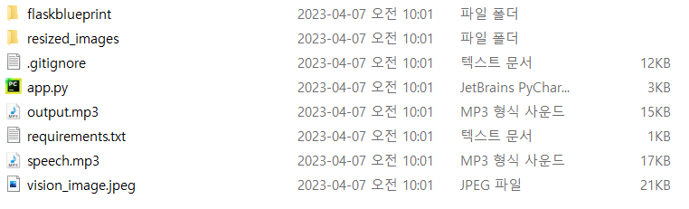

# ML

## 0. 디렉토리 구조

```
ml
├─ ml_server
		├─ flaskblueprint
├─ ml_microservice
		├─ ml_aivoice
		├─ ml_classifier
		├─ ml_vision
...
```

## 1. 포팅 메뉴얼

> MicroService는 배포용 이기 때문에, 로컬 서버용인 ML_server 기준으로 설명합니다.
> 
1. app.py가 위치한 디렉토리까지 접근 합니다.
    
    
2.  `python -m venv venv` : 가상환경을 만들어줍니다.
    
    
3. `source venv/Script/activate` : 가상환경을 작동시켜줍니다.
    
    
    → 만약 venv가 정상 작동하면 위에 (venv) 가 붙습니다.
    
4. `pip install -r requirements.txt` 필요한 라이브러리를 설치해줍니다.
    
    
5. `python [app.py](http://app.py)` : app.py를 실행해줍니다.
    - Tip!
        
        > 만약 오류가 났다? → .env 파일의 부재일 가능성이 큽니다.
        > 
        
        
        
        → 이렇게 vision_api_key 오류가 났다면, 윗 단락의 .gitignore 을 참고해주세요.
        

## 2. 프로젝트 진행

### 0. 학습

- 머신 러닝 학습 사이트
    
    > 머신 러닝 관련 교육을 받으실 수 있는 사이트 입니다.
    > 
    
    ## 1. Dacon
    
    [DACON : 인공지능 경진대회 플랫폼 데이콘 Data Science AI Competitions  - DACON](https://dacon.io/hackathon)
    
    - 머신러닝, 데이터 분석 관련 각종 대회 수시 개최, 데이터 분석 계열의 백준 같은 느낌
        
        
    
    ## 2. Kaggle
    
    [Kaggle: Your Machine Learning and Data Science Community](https://www.kaggle.com/)
    
    - 이 분야의 끝판왕. 데이터 분석~최신 머신러닝 등 모든 것이 다 들어있다.
    - 대신 영어로 되어있으며, 캐글 코리아 라는 페이스북 홈페이지가 QNA용 오카방을 운영중.
    - 배울 수 있는 것들이 잘 나열되어있음.
        
        
        
                
        
- 머신 러닝 모델 사이트
    
    ## 1. AI-HUB
    
    [AI-Hub](https://aihub.or.kr/)
    
    - 한국에서는 이 곳 만큼 제대로 정리해준 곳이 없습니다.
    - 데이터 셋과 관련 학습 모델 등 다양한 자료들을 전부 제공해주고 있습니다.
    - 실제로 이전에 상을 받았던 모델들은 대부분 여기에서 가져온 자료들입니다.
        - 예시
            - 마스크를 쓴 싸피인들의 얼굴을 인식해서 자동으로 출첵을 해주는 기능
                
                
                
            - 그림을 그리면 → 동물들의 먹이로 줄 수 있는 기능
                
                
                
            - 반려동물 안구질환 체크해주는 어플리케이션
                
                
                
    
    ## 2. Hugging Face
    
    [Hugging Face – The AI community building the future.](https://huggingface.co/)
    

### 1. 개발 환경

[0. Start with Anaconda](0%20Start%20with%20Anaconda%205b623929cef2481b91ab3aef8ae74573.md)

[1. 작업 환경 정하기](1%20%E1%84%8C%E1%85%A1%E1%86%A8%E1%84%8B%E1%85%A5%E1%86%B8%20%E1%84%92%E1%85%AA%E1%86%AB%E1%84%80%E1%85%A7%E1%86%BC%20%E1%84%8C%E1%85%A5%E1%86%BC%E1%84%92%E1%85%A1%E1%84%80%E1%85%B5%202f71ded520aa4507a60eff4e88231c7d.md)

### 2. 머신 러닝

[2. 머신 러닝 모델 & API 정하기](2%20%E1%84%86%E1%85%A5%E1%84%89%E1%85%B5%E1%86%AB%20%E1%84%85%E1%85%A5%E1%84%82%E1%85%B5%E1%86%BC%20%E1%84%86%E1%85%A9%E1%84%83%E1%85%A6%E1%86%AF%20&%20API%20%E1%84%8C%E1%85%A5%E1%86%BC%E1%84%92%E1%85%A1%E1%84%80%E1%85%B5%20340f91c61e7f4f4bbd57e083bb6bf73c.md)

[3. 모델 학습 시키기](3%20%E1%84%86%E1%85%A9%E1%84%83%E1%85%A6%E1%86%AF%20%E1%84%92%E1%85%A1%E1%86%A8%E1%84%89%E1%85%B3%E1%86%B8%20%E1%84%89%E1%85%B5%E1%84%8F%E1%85%B5%E1%84%80%E1%85%B5%2063fac2b7b1d64b8989aa99b19599bf89.md)

### 3. CI / CD

[4. 기능 연결하기](4%20%E1%84%80%E1%85%B5%E1%84%82%E1%85%B3%E1%86%BC%20%E1%84%8B%E1%85%A7%E1%86%AB%E1%84%80%E1%85%A7%E1%86%AF%E1%84%92%E1%85%A1%E1%84%80%E1%85%B5%20ca21e7834ec645f4b5ab546e301cf259.md)